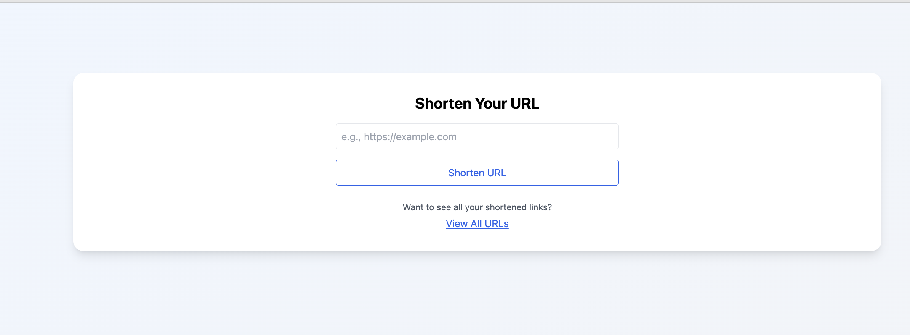
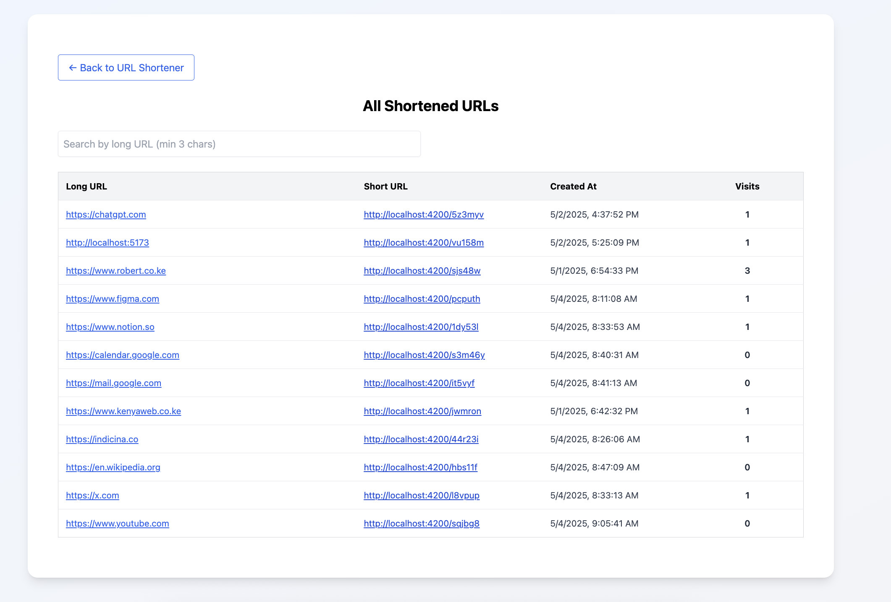

# URL Shortener

URL Shortener is a full-stack web application that allows users to shorten long URLs, track visits, and view analytics for each shortened link.

- **Frontend:** React.js, Tailwind CSS, TypeScript
- **Backend:** Node.js, Express.js
- **Database:** Supabase
- **Testing:**: Vitest

## Getting Started

Follow the steps below to set up and run the project locally.

### Clone the Repository

```bash
git clone https://github.com/parsimeikoikai/url-shortener.git
cd url-shortener
```

## Backend Setup

```bash
cd server
cp .env.example .env
yarn install
yarn dev
```

### Required .env variables:

```bash
SUPABASE_URL=https://your-project.supabase.co
SUPABASE_KEY=your-supabase-anon-key
PORT=4200
```

## Frontend Setup

```bash
cd client
cp .env.example .env
yarn install
yarn dev
```

### Required .env variables:

```bash
BACKEND_URL=Backend API Url
```

### Run Test

To run tests for the backend :

```bash
cd server
yarn test
```

### Supabase Setup Instructions

1. Go to your [Supabase dashboard](https://app.supabase.com/) and create a new project.
2. Create a table named `short_links` with the following columns:

```bash
| Column         | Type       | Notes                    |
|----------------|------------|--------------------------|
| id             | int8       | Primary Key, Auto Increment |
| short_code     | text       | Unique                   |
| original_url   | text       | Required                 |
| visit_count    | int8       | Default: 0               |
| created_at     | timestamptz | Default: now()           |
| last_accessed  | timestamptz | Nullable                 |
```

3. Copy your Supabase project URL and API key, and add them to your server `.env` file:

```bash
SUPABASE_URL=your-project-url
SUPABASE_KEY=your-anon-key
```

### Features

- Shorten any long URL
- View click/visit counts
- Track creation and last access dates
- List all shortened URLs
- Search and filter URLs
- Copy and share shortened links

### Screenshots




